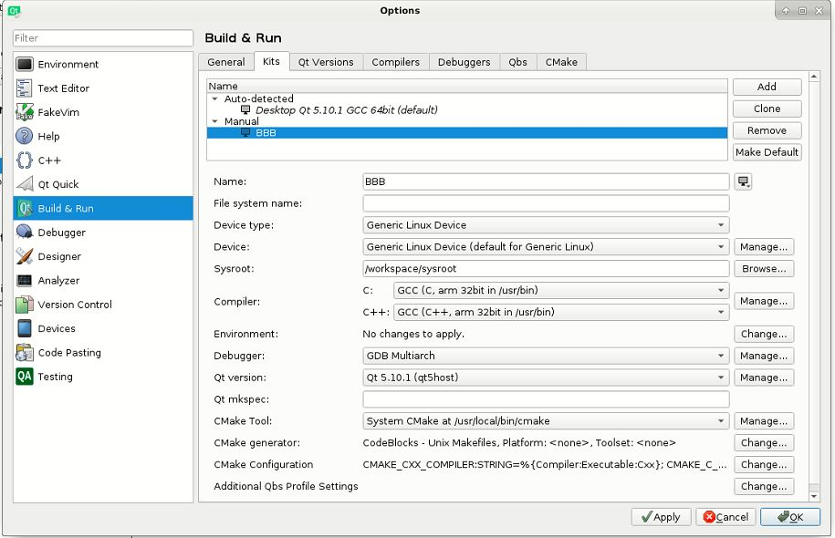
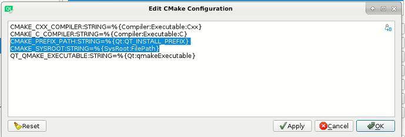

## Step 1: Download SD Card Image

`bone-debian-9.5-lxqt-armhf-2018-10-07-4gb.img.xz`

## Step 2: Flash onto SD Card

## Step 3: Share Internet b/w Host and BBB

https://gist.github.com/wahabshah/9c19af6c2960c60dfd8b28ecd4556c01

## Step 4: Boot BBB & update libraries

```sh
ssh debian@192.168.7.2

sudo /opt/scripts/tools/grow_partition.sh
sudo reboot

echo "nameserver 8.8.8.8" > /etc/resolv.conf
sudo route add default gw 192.168.7.1
ping google.com

sudo apt update
sudo apt install libgles2-mesa-dev

sudo nano /etc/sudoers
debian ALL= NOPASSWD:/usr/bin/rsync
```

## Step 5: Sync Sysroot from BBB to Host

```sh
docker build -t qt-test-image .
docker run --rm -v ${PWD}:/usr/app -v ${PWD}/workspace:/workspace -v ${PWD}/scripts:/scripts qt-test-image /usr/app/syncSysroot.sh
```

## Step 6: Start cross-compiling Qt

```sh
docker build -t qt-test-image .
docker run --rm -v ${PWD}:/usr/app -v ${PWD}/workspace:/workspace -v ${PWD}/scripts:/scripts qt-test-image /usr/app/buildQt.sh
```

## Step 7: Sync Qt from Host to BBB

```sh
docker build -t qt-test-image .
docker run --rm -v ${PWD}:/usr/app -v ${PWD}/workspace:/workspace -v ${PWD}/scripts:/scripts qt-test-image /usr/app/syncQtToSysroot.sh
```

## Step 8a: Configuring Qt Creator

* /workspace/OUTPUT/qt5
* /workspace/OUTPUT/qt5host
* /workspace/sysroot


```sh
Dislabe Logout so that dont get black screen

sudo apt install gdb-multiarch
sudo apt install xfce4 xfce4-goodies
sudo apt install tightvncserver

~/.vnc/xstartup
#!/bin/bash
xrdb $HOME/.Xresources
startxfce4 &

sudo xvncserver
```


```sh
rsync -avzn --progress --list-only --include 'workspace/' --include 'workspace/OUTPUT/***' --include 'worksprace/sysroot/***' --exclude '*'  /home/wahab/Qt/workspace /home/wahab/Test
sudo rsync -avz --progress --include 'workspace/' --include 'workspace/OUTPUT/***' --exclude '*'  /home/wahab/Qt/workspace /
sudo rsync -avz --progress --include 'workspace/' --include 'workspace/sysroot/***' --exclude '*'  /home/wahab/Qt/workspace /
```

Tightvncserver localhost:5900

To use Qt Creator properly, you must configure the "Qt Version" and "Tool Chains" sections.

Sysroot: /workspace/sysroot

Tool Chain Settings[edit] go to Tools -> Options..-> Build & Run -> Compilers tab. click in "Add -> GCC". On "Compiler Path" set to "/usr/bin/arm-linux-gnueabihf-g++". Name it "ARM GCC" or similar. obs: Adjust it to your username.

Qt Version settings.[edit] Now go to Tools -> Options..-> Build & Run -> Qt Versions tab. Click in "Add.." and choose you qmake for bbb "/workspace/OUTPUT/qt5host/bin/qmake".

Configure Linux Devices[edit] Go to Tools -> Options…-> Devices -> Devices tab.

Add a new configuration setting a "Generic Linux Device" Hostname or IP address is the IP of your BBB user is debian password is temppwd. if your not did change it.

Update CMake => Use Sysroot

* CMAKE_PREFIX_PATH:STRING=%{Qt:QT_INSTALL_PREFIX}

    From first one, CMake will get path to cmake module for Qt5
* CMAKE_SYSROOT:STRING=%{SysRoot:FilePath}

    From second one, CMake will search for libraries Qt is dependent on from sysroot




## Step 8b: Configuring QMake

```sh
docker build -t qt-test-image .
docker run --rm -v ${PWD}:/usr/app -v ${PWD}/workspace:/workspace -v ${PWD}/scripts:/scripts -v ${PWD}/App:/App qt-test-image /usr/app/buildApp.sh
```

## Step 8c: Configuring CMake

```sh
docker build -t qt-test-image .
docker run --rm -v ${PWD}:/usr/app -v ${PWD}/workspace:/workspace -v ${PWD}/scripts:/scripts -v ${PWD}/App:/App qt-test-image /usr/app/buildAppCMake.sh
```

## Step 9b: Sync App (qmake) to Sysroot

```sh
docker build -t qt-test-image .
docker run --rm -v ${PWD}:/usr/app -v ${PWD}/workspace:/workspace -v ${PWD}/scripts:/scripts -v ${PWD}/App:/App qt-test-image /usr/app/syncAppToSysroot.sh
```

## Step 9c: Sync App (cmake) to Sysroot

```sh
docker build -t qt-test-image .
docker run --rm -v ${PWD}:/usr/app -v ${PWD}/workspace:/workspace -v ${PWD}/scripts:/scripts -v ${PWD}/App:/App qt-test-image /usr/app/syncAppCMakeToSysroot.sh
```

## Step 10a: Start App (qt creator) on BBB

## Step 10b: Start App (qmake) on BBB

Available platform plugins are: linuxfb, minimal, offscreen, vnc, webgl, xcb.

```sh
cd /home/debian/cross_build
sudo ./scratchpad -platform vnc
```

Tigervnc 192.168.7.2:5900


DISPLAY=:0.0 ./scratchpad  -platform xcb
bbb-4dcape70t.dtb
am335x-boneblack-4dcape-43t.dtb

## Step 10c: Start App (cmake) on BBB

```sh
cd /home/debian/build_cross_cmake
sudo ./scratchpadcmake -platform vnc
```

Tigervnc 192.168.7.2:5900

## Step 10d: Start App (amd64 cmake or qmake) in WSL

```sh
~/App/build$ ./scratchpad -platform vnc
```
Tigervnc (ip addr) 5900

or
vncserver :2
~/App/build$ EXPORT=DESKTOP-T88FK82.localdomain:2 ./scratchpad
./scratchpad -display DESKTOP-T88FK82.localdomain:2

EXPORT=172.28.97.153:2 ./scratchpad


## Tips

* To log into contianer
docker run --rm -v ${PWD}:/usr/app -v ${PWD}/workspace:/workspace -v ${PWD}/scripts:/scripts -v ${PWD}/App:/App -it qt-test-image /bin/bash
* Start VNCServer on BBB
    debian@beaglebone:~$ vncserver

    New 'X' desktop is beaglebone:1

    Starting applications specified in /home/debian/.vnc/xstartup
    Log file is /home/debian/.vnc/beaglebone:1.log
* Connect from Host to BBB via VNC
  Open up VNC viewer (or whichever client app you're using)
  Type in the IP address of your BBB and the port number at the end of the VNC server field: 192.168.7.2:1. The default my be "beaglebone:1.
  You will then have a window pop up Unencrypted Connection.
  Click Continue.
  Select Connect.

Building Qt for a given device requires a toolchain and a sysroot. Additionally, some devices require vendor-specific adaptation code for EGL and OpenGL ES 2.0 support. This is not relevant for non-accelerated platforms, such as those that use the LinuxFB plugin, which is meant for software-based rendering only.

The qtbase/mkspecs/devices directory contains configuration and graphics adaptation code for a number of devices. For example, the linux-rasp-pi2-g++ mkspec contains build settings such as the optimal compiler and linker flags for the Raspberry Pi 2 device. The mkspec also contains information about either an implementation of the eglfs hooks (vendor-specific adaptation code), or a reference to the suitable eglfs device integration plugin. The device is selected through the configure tool's -device parameter. The name that follows after this argument must, at least partially, match one of the subdirectories under devices.

The most important parameters are -device and -sysroot. By specifying -sysroot, the include files and libraries used by configure's feature detection tests, as well as Qt itself, are taken from the specified location, instead of the host PC's standard locations. Specifying -sysroot results in automatically setting the --sysroot argument when invoking the compiler.


extprefix = sysroot + prefix  => control the intended destination directory of the Qt build
 
-sysroot C:/SysGCC/beaglebone/arm-linux-gnueabihf/sysroot
-prefix /usr/local/qt5
-extprefix C:/SysGCC/beaglebone/arm-linux-gnueabihf/sysroot/usr/local/qt5

the ARM build of Qt is expected to be placed in /usr/local/qt5 on the target device
the make install step targets the directory specified by extprefix

hostprefix => allows separating host tools like qmake, rcc, uicm , moc from the binaries for the target. When given, such tools will be installed under the specified directory instead of extprefix.

## Msys (g++) on Windows

C:\Qt\SOURCES\qtbase\configure -platform win32-g++                                     -release -opengl es2 -device linux-beaglebone-g++ -sysroot C:/SysGCC/beaglebone/arm-linux-gnueabihf/sysroot -prefix /usr/local/qt5 -v

C:\Qt\SOURCES\configure       -platform win32-g++                                      -release -opengl es2 -device linux-beaglebone-g++ -sysroot C:/SysGCC/beaglebone/arm-linux-gnueabihf/sysroot -prefix /usr/local/qt5 -device-option CROSS_COMPILE=C:/SysGCC/beaglebone/bin/arm-linux-gnueabihf- -qt-xcb  -v

or 
 
C:\Qt\SOURCES\qtbase\configure -platform win32-g++ -xplatform linux-arm-gnueabihf-g++ -release -opengl es2                              -sysroot C:/SysGCC/beaglebone/arm-linux-gnueabihf/sysroot -prefix /usr/local/qt5 -v

C:\Qt\SOURCES\configure       -platform win32-g++ -xplatform linux-arm-gnueabihf-g++ -release -opengl es2                               -sysroot C:/SysGCC/beaglebone/arm-linux-gnueabihf/sysroot -prefix /usr/local/qt5 -device-option CROSS_COMPILE=C:/SysGCC/beaglebone/bin/arm-linux-gnueabihf- -qt-xcb  -v


## TODO

* Remove duplication of variables
* Split Qt creator (DownloadSourceCode, Configure ,Compile & Install)
* Move all shell scripts under scripts folder
* May be add LD_LIBRARY_PATH to BBB and remove the rpath in cmake command


## Links

* https://elinux.org/Beagleboard:Expanding_File_System_Partition_On_A_microSD
* https://doc.qt.io/qt-5/configure-linux-device.html
* https://wiki.qt.io/RaspberryPi2EGLFS
* https://wiki.qt.io/BeagleBone_Black_Beginners_Guide
* https://learning.oreilly.com/library/view/exploring-beaglebone-2nd/9781119533160/c02.xhtml
* https://gnutoolchains.com/beaglebone/
* https://learning.oreilly.com/library/view/application-development-with/9781789951752/c684fdb0-30b5-48a2-81ad-3d97174a325b.xhtml
* https://ftp.osuosl.org/pub/blfs/conglomeration/qt5/?C=M;O=A
* https://visualgdb.com/tutorials/beaglebone/qt5/cross-compile/
* https://doc.qt.io/qt-5/configure-options.html
* https://askubuntu.com/questions/1044516/inputting-a-password-on-a-script-for-rsync-to-login-to-a-remote-server-to-comple
* https://superuser.com/questions/270911/run-rsync-with-root-permission-on-remote-machine
* https://subscription.packtpub.com/book/hardware_and_creative/9781783982929/1/ch01lvl1sec18/ssh-remote-access
* https://doc.qt.io/qt-5/qpa.html#qpa-plugins
* https://doc.qt.io/qt-5/embedded-linux.html
* https://johanneskinzig.de/index.php/systems-engineering/16-bbb-touchscreen-calibration
* https://gist.github.com/scottellis/ef92b0815b8d4b4ff998
* https://elinux.org/Beagleboard:Capes_3.8_to_3.14#4dcape-70t
* http://download.swsoft.com/virtuozzo/virtuozzo4.0/docs/en/lin/VzLinuxUG/11481.htm
* https://cdn.sparkfun.com/assets/2/7/e/6/4/PM-16006.pdf
* https://cdn.sos.sk/productdata/a7/fd/40ea6504/gen4-4dcape-43t.pdf
* https://crashingdaily.wordpress.com/2007/06/29/rsync-and-sudo-over-ssh/
* https://gitlab.kitware.com/cmake/community/-/wikis/doc/cmake/RPATH-handling
* https://packages.debian.org/stretch/amd64/libgles2-mesa-dev/filelist
* https://stackoverflow.com/questions/15687755/how-to-use-rsync-to-copy-only-specific-subdirectories-same-names-in-several-dir
* https://www.digitalocean.com/community/tutorials/how-to-install-and-configure-vnc-on-debian-9
* https://www.tweaking4all.com/software/linux-software/use-xrdp-remote-access-ubuntu-14-04/
* https://dev.to/darksmile92/linux-on-windows-wsl-with-desktop-environment-via-rdp-522g
* https://www.tenforums.com/tutorials/144208-windows-subsystem-linux-add-desktop-experience-ubuntu.html
* https://www.reddit.com/r/bashonubuntuonwindows/comments/6ysgn4/guide_to_xfce4_install_in_wsl_for_advanced_noobs/
* https://wiki.parabola.nu/TightVNC
* https://autoize.com/xfce4-desktop-environment-and-x-server-for-ubuntu-on-wsl-2/
* https://github.com/TigerVNC/tigervnc/issues/684#issuecomment-561605793
* https://www.qt.io/blog/creating-an-embedded-qt-quick-application-in-visual-studio-2/2 => Use WSL to cross compile and debug both C++ and QML on device using Visual Studio
* https://embeddeduse.com/2020/11/21/cross-compiling-qt-embedded-applications-with-qtcreator-and-cmake/ => BEST how to use CMake with qtcreator as to what is needed to debug
* https://gist.github.com/wahabshah/651af63c76823f87f00ef0a198787f8b => Raw GDB and GDB Server commands to debug remotly
